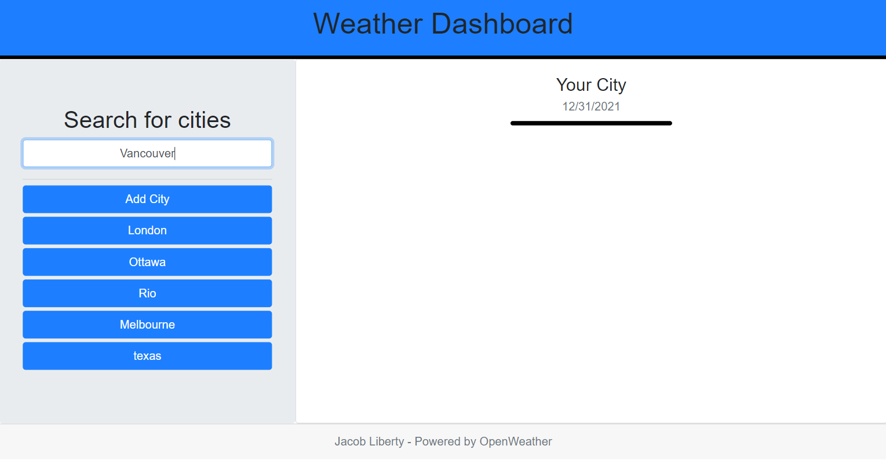
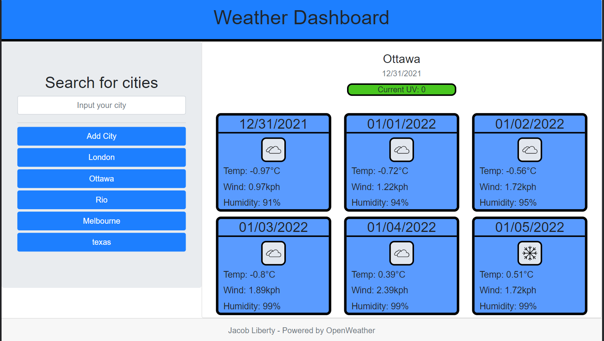

# Weather-Dashboard

## Purpose

Create a Webpage capable of finding weather data based on a city
Save searched cities for later use as a button
Show a 5 day forecast as well as current day
Display Date, Icon, Temperature, Wind, Humidity, and UV Index for current day
Ability to repopulate with new weather data when a different city is searched for or button clicked on.

## Built With

- HTML
- CSS
- Javascript
- Jquery
- Open Weather API
- Bootstrap

## Web Page
The running application can be accessed here for viewing and testing:

https://jacobgit3.github.io/Weather-Dashboard/

The code for the application can be found in this github repository:

https://github.com/JacobGit3/Weather-Dashboard

This is a screenshot of the web page before a search is made

This is a screenshot of the web page after it is populated with weather data

## Contribution

Code written by Jacob Liberty

Inital Code from Trilogy Education

Adapted some Icon and UV code from Ward Vanlaar 
Thanks for the help Ward!
Here is a link to his repository - https://github.com/WardVanlaar/weather-dashboard